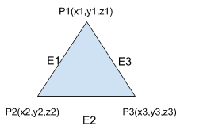
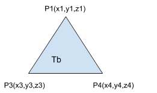
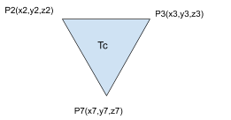
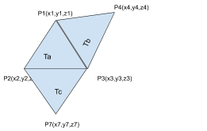
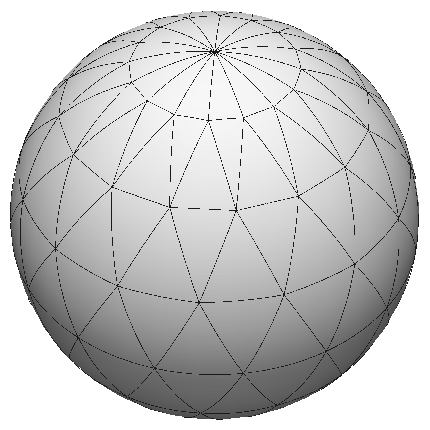
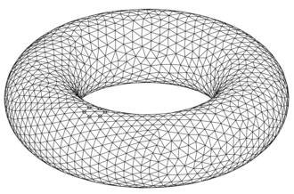
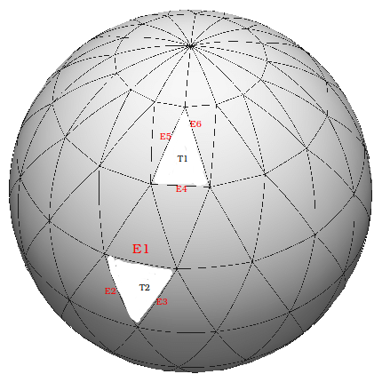
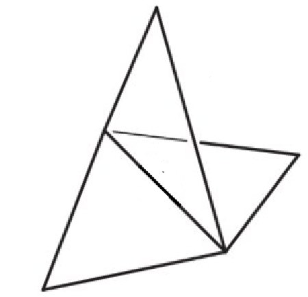
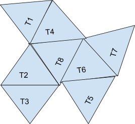
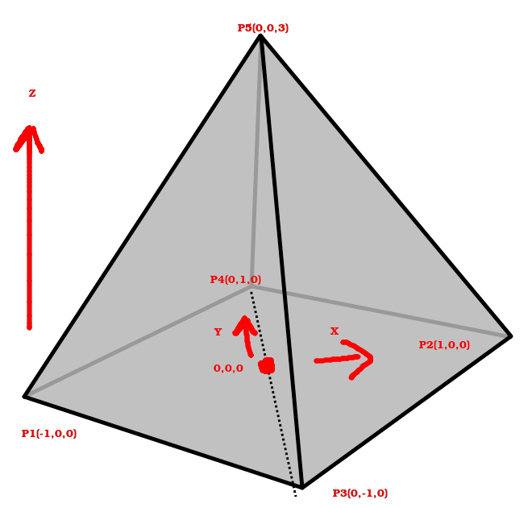

# 3D structures using graphs

## Assignment 6 COL106
Release Date: 19th October 2019.
Due Date: Nov 9 2019
Max marks: 7
Submission on Moodle

NO IMPORTS ALLOWED FOR THIS ASSIGNMENT.
YOU NEED TO IMPLEMENT YOUR OWN SORTING.
NO PRINT REQUIRED.
QUERIES WILL BE TIMED.

## FAQ:

--

1.What should we do when we are given three collinear points in ADD_TRIANGLE query apart from giving false?
DO NOT ADD THIS TO GRAPH

2.Can the number of vertices be more than maximum value of int?
NO

3. What are we supposed to return if the boundary_edges query is given for an improper mesh structure? The given info defines a boundary edge only for a semi-proper mesh type. Can I assume that this query won't be given if the mesh type is improper?
No such query for improper mesh

4. Incident Triangles and face neighbours of a point means same. We will merge both into one. You may return same answer in both of them or either of them. Our driver will handle it.
5. For Each query, all triangles will be unique.

6. The weightasge of validity of triangles will be very less. To avoid confusion, there will be one test case separately just to check validity of triangle. Rest all test cases will have valid triangles.

7. Boundary edges query
In test case 2 on the assignment page, the boundary edges query has the last two edges with the same euclidean distance. So what should be the order of returning them?
Answer: any order


## DESCRIPTION
This assignment is based on Graph Data structure.

A point Pi in 3D space is defined using 3 coordinates xi,yi,zi.

Given 3 unique points, they can be joined to form a triangle. (The sum of two sides is greater than the third side.)
Figure 1:


So, the above triangle is defined by 3 points (P1,P2,P3).This triangle can also be said to contain -- or be bounded by -- three edges, where an edge is an unordered pair of points, e.g., (P1, P2). This means (P1,P2)  is the same as (P2, P1).

Let us now consider creating multiple triangles using the above setup.
````
Triangle Ta : P1, P2, P3
Triangle Tb: P1, P3, P4
Triangle Tc: P2, P3, P7
Triangle Td: P1, P5, P6
````




Figure 2

To create a shape from these triangles,two triangles are joined if they have a common edge.

In the above case it is,





Figure 3: Joining triangles having common edges. Here, the number of connected components = 2.

In general, 3D shapes can be approximated by triangles as shown in Figure 4.




Figure 4 (a & b)

In Figure 4, the first one approximates sphere by triangles. Similarly for the second one.

(Images taken from sources https://www.researchgate.net/figure/Triangulation-of-the-sphere-into-224-isoscales-spherical-triangles_fig5_284836292

(https://en.wikipedia.org/wiki/Triangulation (topology)))

The triangles completely tile a closed shape if there are no missing part of the surface untiled. If, instead, one or more triangles are left out, the triangular approximation is said to have boundary. For example, the sphere in Figure 4 a) becomes sphere in Figure 5, where the triangle bounded by edges E1,E2,E3 as well as that bounded by E4,E5,E6 are missing.



Figure 5 : There are edges(E1,E2,E3,E4,E5,E6) which are boundary edges.

**Definitions :**
A **Proper mesh** is a shape where every edge is a part of exactly 2 triangles. Example : Figure 4.

A mesh is **semi-proper** if there exists at least one edge, which is a part of exactly one triangle and no edge is part of more than 2 triangles. Example: Figure 5.

If a shape contains an edge which is part of more than 2 triangles, then we call it **improper mesh**. Example Figure 6.

The **boundary** of a semi-proper mesh consists of  the edges which are not part of 2 triangles. In the Figure 5 above, it is E4,E5,E6 , E1,E2 and E3.

**NEIGHBORHOOD**

Each vertex, triangle and edge have a neighborhood as described below.

**NEIGHBOR** of a Triangle: If two triangles share a common edge, they are said to be **neighbors** of each other. In Fig.7 Neighbors of T8 are T2, T4 and T6. Neighbor of T3 is T2. Edges bounding a triangle are **edge-neighbors** of the triangle. Similarly, vertices making a triangle are its **vertex-neighbors**.

**EXTENDED NEIGHBOR** of a triangle: If two triangles share a common vertex, they are said to be extended neighbors of each other. In Fig.7 all drawn triangles are extended neighbors of T8.

**NEIGHBOR of a point:** If two points are connected by an edge then they are neighbors of each other. In Figure 1, P1 and P2 are adjacent neighbors. So are  P2 and P3, as are P3 and P1. Edges incident on a point are its **edge-neighbors** and the triangles incident on a point are its **face-neighbors.**

**NEIGHBOR of an edge**: A triangle that any edge is a part of is its **face-neighbor**.  For  edge P1-P3 in Fig 3, triangles Ta and Tb are its face-neighbors.

**PATH:**  A path from triangle T1 to T2 is the set of triangles that we have to follow, or hop across, from T1 in order to reach T2. A hop between two triangles is valid only if they are neighbors, i.e., they share an edge. In Fig 7 A path between T1 to T3 is T1-T4-T8-T2-T3. Note that multiple paths may exist between a pair of triangles.


Figure 6


Figure 7


Figure 8

**Implementation:

You need to implement Graph data structure in order to store the triangles, the points and edges. The below queries have to be answered using the created graph data structure. No imports are allowed. Efficiency is important: 2 marks are for execution speed.

The queries documented below are labeled with a name and parameters. Your task is actually to implement the attached interface, which uses similar method names. The numbers are all floats.

The default in ShapeInterface is added so that you can build your implementation incrementally.**

## **QUERIES:**

**ADD_TRIANGLE X1 Y1 Z1  X2 Y2 Z2 X3 Y3 Z3**

This query creates a creates- a triangle from 3 points P1(X1,Y1,Z1), P2(X2,Y2,Z2), P3(X3,Y3,Z3). It includes 9 numbers, which together represent one triangle.

It returns True if the triangle is valid. A triangle is valid if the 3 points are non-collinear else it is not valid.

**TYPE_MESH**

This query returns the type of mesh created by the triangles. This query will be given only when triangles are valid. Return type is integer. Return 1 for proper_mesh, 2 for semi proper mesh and 3 for improper mesh.

**COUNT_CONNECTED_COMPONENTS**

This query counts the number of connected components and returns it.This query will be given only when triangles are valid. 2 triangles are connected if there is a path between them.

**BOUNDARY_EDGES**

This query returns the edges which are part of the boundary. (An edge is made up of 2 points. The 2 points could be in any order.) The returned edges should be sorted based upon non-decreasing edge length. The edge length is the Euclidean distance between its endpoints. You must implement your own sorting.

In case there are no boundary edges return null.

This query will be given only when triangles are valid.

**NEIGHBORS_OF_TRIANGLE X1 Y1 Z1 X2 Y2 Z2 X3 Y3 Z3**

Return all the triangles which are neighbors to the given triangle. The Triangles should be returned in the order of their insertion.

Return null if query triangle does not exist.

Each returned triangle is an object of Triangle interface (This applies to all triangle queries.)

This query will be given only when triangles are valid.

Return null if query triangle does not exist.

**EDGE_NEIGHBOR_TRIANGLE X1 Y1 Z1 X2 Y2 Z2 X3 Y3 Z3**

Return all the edge neighbors of the triangle. Each returned  edge is an object of EdgeInterface( This follows everywhere). The order between edges does not matter.

Return null if query triangle does not exist.

**VERTEX_NEIGHBOR_TRIANGLE X1 Y1 Z1 X2 Y2 Z2 X3 Y3 Z3**

Return all the vertex neighbors of this triangle. Each  returned vertex is an object of PointInterface. ( This follows for all point queries.)

The order between vertices does not matter.

Return null if query triangle does not exist.

**EXTENDED_NEIGHBOR_TRIANGLE X1 Y1 Z1 X2 Y2 Z2 X3 Y3 Z3**

Returns all the extended neighbors of this triangle.

The order within the neighbors is First come first serve. The triangle which was created first is returned first.

In case there are no extended neighbors of  query triangle, return null.

Return null if query triangle does not exist.

This query will be given only when triangles are valid.

**IS_CONNECTED Xa1 Ya1 Za1 Xa2 Ya2 Za2 Xa3 Ya3 Za3 Xb1 Yb1 Zb1 Xb2 Yb2 Zb2 Xb3 Yb3 Zb3**

Given two triangles Ta and Tb created using points  Xa1 Ya1 Za1 Xa2 Ya2 Za2 Xa3 Ya3 Za3 and Xb1 Yb1 Zb1 Xb2 Yb2 Zb2 Xb3 Yb3 Zb3  respectively, check if they are connected by a path consisting of triangles in between. A hop from triangle R1 to R2 is allowed if R2 is a neighbor of R1(They must share an edge).

Return True if they are connected else False.

This query will be given only when triangles are valid.

Return False if query triangle does not exist.

**INCIDENT_TRIANGLES X Y Z**

Given a point (X,Y,Z), return all the triangles which have one vertex as (X,Y,Z). The triangles are to be returned in the order of their insertion.

If the query point does not exist return null.

**NEIGHBORS_OF_POINT X Y Z**

Given a point (X,Y,Z), return all the points which are neighbors of it. The points can be returned in any order.

If the query point does not exist, return null.

**EDGE_NEIGHBORS_OF_POINT X1 Y1 Z1**

Given a point (X,Y,Z), return all its edge neighbors. The order of edges does not matter.

If the query point does not exist return null.

**FACE_NEIGHBORS_OF_POINT X1 Y1 Z1**

Given a point (X,Y,Z), return all its Face neighbors.

The triangles are to be returned in the order of their insertion.

If the query point does not exist return null.

**TRIANGLE_NEIGHBOR_OF_EDGE X1 Y1 Z1 X2 Y2 Z2**

Given two points P1(X1,Y1,Z1) and P2(X2,Y2,Z2), return the triangles which are incident on the edge connecting P1 and P2.

The triangles should be returned in the order as they were inserted.

If the query edge does not exist return null.

**MAXIMUM_DIAMETER**

The diameter is defined as the maximum topological distance between 2 triangles in the shape. Topological distance is defined as the minimum  number of hops required to go from triangle T1 to triangle T2 by hopping through triangles in between. A hop from a triangle R1 to triangle R2 is allowed only if R1 and R2 share a common edge. Ex: Fig 7 the diameter is 4.

For this query, return the diameter of the shape produced. If shape is having more than 1 component return  the diameter of the component which has maximum number of triangles (any one, if multiple maxima exist) If the largest component has just 1 triangle return 0.

**CENTROID**

Return an array of the centroids of different connected components. The centroid of a connected component is a point (x, y, z) such that x is the average of x coordinates of all vertices of that component, y is the average of y. and z of z components. The centroids should be sorted by their X coordinates first, and then by Y and then by Z. Two coincident centroids may appear in any order.

 

**CENTROID OF COMPONENT X Y Z**

For the connected component containing point P(X,Y,Z), return its centroid.

**CLOSEST COMPONENTS**

Find the distance between the closest connected components.

The distance between two components is defined as the minimum Euclidean distance between any two  vertices, respectively, of the two components.

For the shapes that you have found,to be closest you need to return the 2 closest vertices(one in first shape, other of second shape) as an array of 2 points. The order does not matter.

If there are multiple such pairs of vertices possible, return any 1.

**Test case 1( Fig 8)**
````

ADD_TRIANGLE -1 0 0 0 -1 0 0 0 3
ADD_TRIANGLE -1 0 0 0 -1 0 0 1 0
ADD_TRIANGLE -1 0 0 0 0 3 0 1 0
ADD_TRIANGLE 1 0 0 0 -1 0 0 1 0
ADD_TRIANGLE 1 0 0 0 -1 0 0 0 3
ADD_TRIANGLE 1 0 0 0 1 0 0 0 3
TYPE_MESH
COUNT_CONNECTED_COMPONENTS
BOUNDARY_EDGES
IS_CONNECTED  -1 0 0 0 -1 0 0 0 3  1 0 0 0 1 0 0 0 3
NEIGHBORS_OF_POINT -1 0 0
NEIGHBORS_OF_TRIANGLE -1 0 0 0 -1 0 0 0 3
INCIDENT_TRIANGLES  1 0 0
VERTEX_NEIGHBOR_TRIANGLE -1 0 0 0 -1 0 0 0 3
EXTENDED NEIGHBOR_TRIANGLE -1 0 0 0 -1 0 0 0 3
MAXIMUM_DIAMETER
EDGE_NEIGHBOR_TRIANGLE -1 0 0 0 -1 0 0 0 3
TRIANGLE_NEIGHBOR_OF_EDGE -1 0 0 0 -1 0
````
Return:
````
True
True
True
True
True
True
1
1
null
True
[(0, 0 ,3),(0 ,-1 ,0),(0 ,1 ,0 )]
[[(-1,0 ,0), (0 ,-1, 0), (0, 1, 0)], [(-1, 0 ,0),( 0 ,0, 3), (0, 1, 0)] , [[(1,0 ,0) ,(0 ,-1, 0), (0 ,0 ,3)]]
[[(1 ,0, 0), (0 ,-1 ,0),( 0 ,1, 0)],[(1, 0 ,0),( 0 ,-1, 0),( 0 ,0 ,3)],[(1 0 0),( 0 1 0),( 0, 0, 3)]]
[(-1 0 0), (0 -1 0), (0, 0, 3)]
[ [(-1, 0, 0), (0 ,-1, 0), (0, 1, 0)],[(-1, 0, 0), (0, 0, 3), (0, 1 ,0)],[(1, 0, 0),( 0, -1, 0),( 0, 1, 0)],[(1, 0, 0).( 0 -1 0),( 0, 0, 3)],[(1, 0, 0),( 0 1 0),( 0 ,0 ,3)]
2
[[(-1, 0, 0),( 0, -1, 0)],[(-1, 0, 0),( 0, 0, 3),[(0, 0, 3),( 0, -1, 0)]]
[[(-1, 0, 0),( 0, -1, 0),( 0, 0, 3)],[ (-1, 0, 0),( 0, -1, 0),( 0, 1, 0)]]
````
**Test case 2( Fig 8, Triangle P5 P3 P2 removed)**
````
ADD_TRIANGLE -1 0 0 0 -1 0 0 0 3
ADD_TRIANGLE -1 0 0 0 -1 0 0 1 0
ADD_TRIANGLE -1 0 0 0 0 3 0 1 0
ADD_TRIANGLE 1 0 0 0 -1 0 0 1 0
ADD_TRIANGLE 1 0 0 0 1 0 0 0 3
TYPE_MESH
COUNT_CONNECTED_COMPONENTS
BOUNDARY_EDGES
````
Return:
````
True
True
True
True
True
2
1
[  (1, 0, 0), (0, -1, 0) ],[ (0 ,-1 ,0), (0, 0, 3) ], [ (1, 0, 0), (0, 0, 3) ]]
````
**Test Case 3**
````
ADD_TRIANGLE -1 0 0 0 -1 0 0 1 0
ADD_TRIANGLE 0 -1 0 0 0 3 0 1 0
ADD_TRIANGLE 0 1 0 0 -1 0 1 0 0
TYPE_MESH
NEIGHBORS_OF_POINT -1 0 0
````
Returns:
````
True
True
True
3
[(0, -1, 0), (0, 1, 0)]
````
**Test Case 4**
````
ADD_TRIANGLE -1 0 0 0 -1 0 0 1 0
ADD_TRIANGLE 3 4 5 6 7 8 9 10 12
COUNT_CONNECTED_COMPONENTS
IS_CONNECTED -1 0 0 0 -1 0 0 1 0 3 4 5 6 7 8 9 10 12
CENTROID
CENTROID_OF_COMPONENT 9 10 12
CLOSEST_COMPONENTS
````
Returns:
````
True
True
2
False
[[-0.333, 0, 0],[ 6,7,8.333]]
[6, 7, 8.333]
[[0, 1, 0], [3,4,5]]
````
**Submission instructuions**
As always compress src directory to zip format and rename the zip file in the format entrynumber_assignment6.zip. For example, if your entry number is 2012CSZ8019, the zip file should be named 2012CSZ8019_assignment6.zip. Then you need to convert this zip file to base64 format as follows and submit the .b64 file on Moodle.
`base64 entrynumber_assignment6.zip > entrynumber_assignment6.zip.b64`
**Folder structure:** Inside the src directory, you need to have a README.pdf or README.txt (case sensitive) and your solution (exactly following the folder structure that of the code provided.). Please do not rename the existing directories. You need to report the time complexities of all your implementations. Explain in brief the non-trivial parts.

**Grading:** While grading we will replace the driver code and the interface code with the original files before the compilation. So please ensure that your code compiles and run correctly with the original driver and interface files. Timer will be added to time queries.

**MOSS:** Please note that we will run MOSS on the submitted code. Anyone found with a copied code, either from Internet or from another student, will be dealt as per the class policy. 

Manoj Kumar
